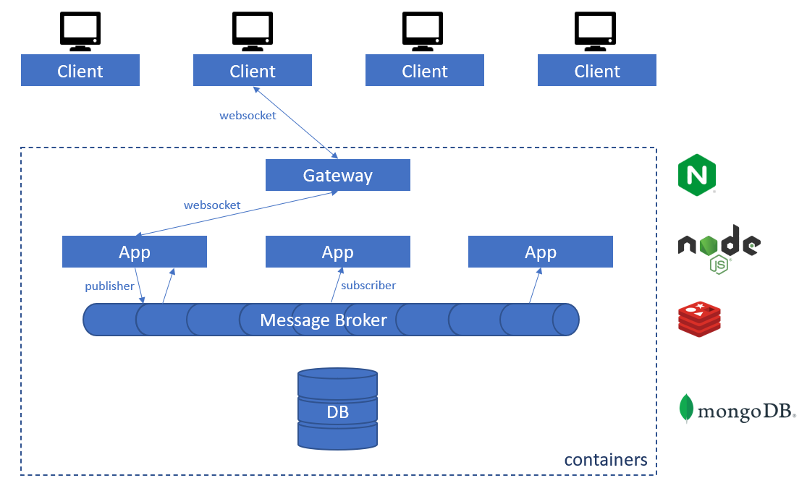

# Architecture description

Let's take the example of a new chat message being typed by one client:

1. Send message
    - one client sends a message to one app instance through websocket
    - this message is sent in a specifc chat room
2. Save to persistent storage
    - the app instance first stores the message in DB (anyone can join the chat later and will need all messages)
    - each room is a MongoDB document, in which the new message is appended
3. Publish to message broker
    - then, the app instance publishes this message to the message broker
4. Receive notification through subscriber
    - each app instance receives this message through its subscriber (including the original publishing app instance)
5. Broadcast to clients
    - each app instance broadcasts the new chat message to all its clients (registered to this specific chat room)
    - that includes the original message author, on its specific app instance
